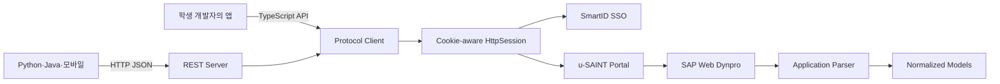

# 숭실대학교 u-SAINT 비공식 오픈소스 라이브러리 프로젝트 계획서

> 문서 버전: 0.2  
> 작성일: 2026-08-09  
> 최근 수정일: 2026-08-10  
> 프로젝트명: `ssu-saintbridge`  
> 상태: Phase 0 착수 준비  
> 실행 로드맵: [ROADMAP.md](./ROADMAP.md)

## 1. 프로젝트 개요

### 1.1 목적

숭실대학교 u-SAINT의 SSO 인증과 SAP Web Dynpro 통신을 일반 개발자가 직접 다루지 않아도 되도록 추상화한다. 학생 개발자가 자신의 계정으로 학사 정보를 안전하게 조회하고, 시간표 앱·졸업요건 계산기·학사 AI·CLI·MCP 서버 등의 서비스를 만들 수 있는 비공식 오픈소스 도구를 제공한다.

프로젝트는 다음 두 핵심 결과물을 제공한다.

1. `Protocol Client`: u-SAINT 인증, 세션, Web Dynpro 이벤트, 응답 파싱을 처리하는 TypeScript 라이브러리
2. `REST Server`: Protocol Client를 HTTP/JSON API로 제공하는 로컬 우선 서버

### 1.2 핵심 가치

- 복잡한 SAP 화면을 일관된 TypeScript 타입과 JSON으로 변환한다.
- 사용자별 인증·쿠키·Web Dynpro 상태를 완전히 격리한다.
- 초기 버전은 읽기 전용으로 제공한다.
- 실제 비밀번호, 쿠키, SSO 토큰을 저장·로깅·외부 노출하지 않는다.
- HTML 선택자 모음이 아니라 테스트 가능한 프로토콜 계층으로 설계한다.
- Node.js 개발자는 라이브러리로, 다른 언어 개발자는 REST API로 사용할 수 있게 한다.

### 1.3 공식성 고지

본 프로젝트는 숭실대학교 또는 SAP의 공식 프로젝트가 아니다. 학교의 로고·상표를 공식 제휴로 오인할 방식으로 사용하지 않는다. 접근통제, 2차 인증, CAPTCHA, 계정 잠금, 요청 제한을 우회하지 않는다. 학교 정책 또는 시스템 변경에 따라 일부 기능이 중단될 수 있음을 README와 API 문서에 명시한다.

## 2. 문제 정의

u-SAINT는 일반적인 공개 REST API가 아니라 SSO와 SAP 포털/Web Dynpro 화면을 기반으로 동작한다. 클라이언트는 다음 상태를 함께 관리해야 한다.

- `smartid.ssu.ac.kr` SSO 로그인과 리다이렉트
- 도메인별 세션 쿠키
- 포털 로그인 완료 여부
- Web Dynpro application URL과 form action
- context ID, secure ID 등 화면 상태값
- 사용자 동작을 표현하는 이벤트 큐
- 요청 이후 갱신되는 화면 상태
- 세션 만료와 재인증

SAP 공식 문서도 Web Dynpro 애플리케이션이 초기 구동 시 여러 번의 round trip으로 세션 정보와 보안 키를 교환하며, 서버 측 세션이 inactivity timeout의 영향을 받는다고 설명한다.

따라서 본 프로젝트의 핵심은 단순 HTML 크롤링이 아니라 다음 상태 머신을 안정적으로 구현하는 것이다.

```text
Anonymous
   ↓ SSO 인증
SsoAuthenticated
   ↓ portal callback/redirect
PortalAuthenticated
   ↓ Web Dynpro bootstrap
ApplicationReady
   ↓ event request/response
ApplicationReady (state updated)
   ↓ timeout/logout/error
Expired or Closed
```

## 3. 목표와 비목표

### 3.1 1차 목표

- TypeScript 기반 독립 u-SAINT protocol client 구현
- 계정 로그인과 로그아웃
- 세션 상태와 만료 감지
- 학생 기본정보 조회
- 학기별 수강내역 조회
- 시간표 데이터 정규화
- 동일 기능의 REST API 제공
- OpenAPI/Swagger 문서 제공
- npm 및 Docker 배포
- 민감정보 없는 fixture 기반 자동 테스트

### 3.2 중기 목표

- 학기별 성적과 성적 요약
- 장학금, 채플, 등록금 내역
- 졸업사정표 및 졸업요건 원천 데이터
- TypeScript REST client SDK
- OpenAPI 기반 Python·Kotlin·Swift client 생성 가이드
- MCP adapter 예제

### 3.3 명시적 비목표

초기 버전에서는 다음 기능을 구현하지 않는다.

- 수강신청 및 수강취소
- 휴학·복학·전과 등의 신청
- 성적 이의신청
- 강의평가 제출
- 등록금 또는 기타 금액 납부
- 2차 인증이나 CAPTCHA 우회
- 타인의 계정 또는 대량 계정 조회
- 학교 서버의 비공개 취약점 탐색
- 학생의 학사 데이터를 프로젝트 서버에 장기 보관하는 SaaS
- 학생의 원본 학번·비밀번호를 프로젝트 운영 중앙 서버가 수집하는 로그인 대행 서비스

## 4. 대상 사용자와 사용 시나리오

### 4.1 대상 사용자

| 사용자                          | 필요 기능                     | 권장 설치 방식                        |
| ------------------------------- | ----------------------------- | ------------------------------------- |
| Node.js 개발자                  | 코드에서 u-SAINT 직접 조회    | `@ssu-saintbridge/protocol`           |
| Python·Java·Swift·Kotlin 개발자 | 언어와 무관한 JSON API        | `@ssu-saintbridge/server` 또는 Docker |
| 웹 프론트엔드 개발자            | REST 호출용 타입 안전 SDK     | 향후 `@ssu-saintbridge/client`        |
| 프로젝트 기여자                 | 프로토콜 분석·파서 개선       | 모노레포 개발 환경                    |
| 일반 학생                       | 라이브러리로 만들어진 앱 사용 | 직접 설치 대상 아님                   |

### 4.2 대표 사용 시나리오

- 오늘의 수업과 강의실을 보여주는 시간표 앱
- 수업 시작 전 알림을 보내는 Discord/Slack 봇
- 학기별 성적과 취득학점을 분석하는 대시보드
- 남은 졸업요건을 설명하는 개인 학사 AI
- 터미널에서 학생정보와 시간표를 조회하는 CLI
- 사용자의 명시적 요청에 따라 학사정보를 읽는 MCP 도구

## 5. 결과물과 패키지 구성

### 5.1 모노레포

```text
ssu-saintbridge/
├── apps/
│   ├── cli/
│   └── server/
├── packages/
│   ├── protocol/
│   ├── types/
│   └── client/                 # v0.2 이후
├── fixtures/
│   ├── sso/
│   └── webdynpro/
├── docs/
│   ├── authentication.md
│   ├── reverse-engineering.md
│   ├── security.md
│   └── webdynpro.md
├── scripts/
│   └── sanitize-har.ts
├── .github/
│   └── workflows/
├── package.json
├── pnpm-workspace.yaml
├── tsconfig.base.json
├── LICENSE
├── README.md
└── SECURITY.md
```

### 5.2 npm 패키지

| 패키지                      | 책임                                      | 공개 시점 |
| --------------------------- | ----------------------------------------- | --------- |
| `@ssu-saintbridge/types`    | 공통 모델·오류·학기 타입                  | v0.1      |
| `@ssu-saintbridge/protocol` | SSO, 세션, Web Dynpro, application parser | v0.1      |
| `@ssu-saintbridge/server`   | REST API, local session manager, Swagger  | v0.1      |
| `@ssu-saintbridge/client`   | REST API용 TypeScript client              | v0.2      |

실제 패키지명은 npm scope와 이름 사용 가능 여부를 확인한 뒤 확정한다.

### 5.3 의존성 방향

```text
@ssu-saintbridge/types
        ↑
@ssu-saintbridge/protocol
        ↑
   server / cli

@ssu-saintbridge/client ──HTTP──> server
```

`client`는 `protocol`에 의존하지 않는다. 브라우저와 모바일 환경에서는 학교에 직접 접속하지 않고 REST Server만 호출하도록 설계한다.

## 6. 권장 기술 스택

### 6.1 공통

| 영역        | 기술                   | 선택 이유                           |
| ----------- | ---------------------- | ----------------------------------- |
| 언어        | TypeScript strict mode | 상태와 데이터 모델을 명확하게 표현  |
| 런타임      | Node.js 24 LTS         | 장기 지원 및 npm 생태계             |
| 패키지 관리 | pnpm workspace         | 모노레포 패키지 연결과 빠른 설치    |
| 모듈        | ESM                    | 신규 Node.js 라이브러리 기준 단순화 |
| 라이선스    | MIT 제안               | 학생 프로젝트의 재사용 장벽 최소화  |

### 6.2 Protocol Client

| 영역        | 기술                                         |
| ----------- | -------------------------------------------- |
| HTTP        | Node.js Fetch/Undici 기반 자체 `HttpSession` |
| 쿠키        | `tough-cookie`                               |
| HTML 파싱   | `cheerio`                                    |
| XML 파싱    | `fast-xml-parser`                            |
| 데이터 검증 | `zod`                                        |
| 동시성 제어 | application context별 async mutex            |
| 테스트      | Vitest + Undici MockAgent + fixture replay   |

고수준 HTTP 클라이언트에 인증 흐름 전체를 맡기지 않는다. 리다이렉트마다 `Location`과 `Set-Cookie`를 확인할 수 있도록 `redirect: manual`을 사용하고, 도메인별 쿠키를 직접 관리한다.

### 6.3 REST Server

| 영역      | 기술                                      |
| --------- | ----------------------------------------- |
| 서버      | Fastify                                   |
| 스키마    | Zod 또는 JSON Schema 기반 요청·응답 검증  |
| 문서      | `@fastify/swagger`, `@fastify/swagger-ui` |
| 로깅      | Pino redaction                            |
| 세션 저장 | v0.1은 인메모리 TTL store                 |
| 배포      | npm executable + Docker                   |

## 7. 핵심 아키텍처



### 7.1 계층별 책임

#### Transport 계층

- 요청 타임아웃과 response size 제한
- 수동 리다이렉트
- 쿠키 저장과 도메인별 전송
- 문자 인코딩 처리
- retry 여부 판단
- 민감 헤더 redaction

#### SSO 계층

- 로그인 폼 발견과 필수 hidden input 파싱
- 인증 요청
- 리다이렉트 체인 검증
- 로그인 실패·계정 잠금·2차 인증 필요 상태 분류
- 포털 callback 완료 확인

#### Web Dynpro 계층

- application bootstrap
- form action과 security/context 값 추출
- UI element tree 또는 필요한 요소 모델링
- Web Dynpro event 직렬화
- event response 파싱
- context revision 갱신
- 세션·application 만료 감지

#### Application 계층

- 학생정보 화면
- 수강내역 화면
- 시간표 화면
- 이후 성적·장학·채플 화면
- SAP 내부 이름을 공개 API 모델로 변환

#### API 계층

- 요청·응답 스키마
- 사용자별 opaque session token
- session TTL과 logout
- rate limit
- Swagger/OpenAPI
- 표준 오류 응답

## 8. 공개 Protocol API 초안

### 8.1 기본 사용법

```ts
import { SaintClient } from "@ssu-saintbridge/protocol";

// 애플리케이션이 비표시 입력 등 안전한 방식으로 일시적으로 수집한다.
const credentials = await promptForCredentials();

const saint = await SaintClient.login({
  studentId: credentials.studentId,
  password: credentials.password,
});

const student = await saint.student.getInfo();
const courses = await saint.academic.getCourses({
  year: 2026,
  semester: "SECOND",
});

await saint.close();
```

### 8.2 공개 타입 원칙

- SAP control ID, context ID, secure ID를 공개 API에 노출하지 않는다.
- 학기와 상태 값은 string union 또는 enum으로 제공한다.
- 불확실하거나 화면에 없는 값은 빈 문자열이 아니라 `null`로 표현한다.
- 화면 표시용 문자열과 계산용 값을 구분한다.
- 날짜·시간·학점의 단위를 문서화한다.
- 원본 HTML을 기본 응답에 포함하지 않는다.

### 8.3 오류 모델

```ts
type SaintErrorCode =
  | "INVALID_CREDENTIALS"
  | "SECOND_FACTOR_REQUIRED"
  | "ACCOUNT_LOCKED"
  | "SSO_FLOW_CHANGED"
  | "PORTAL_SESSION_EXPIRED"
  | "APPLICATION_CONTEXT_EXPIRED"
  | "UPSTREAM_UNAVAILABLE"
  | "PARSER_MISMATCH"
  | "RATE_LIMITED";

interface SaintError {
  code: SaintErrorCode;
  message: string;
  retryable: boolean;
  cause?: unknown;
}
```

## 9. REST API 초안

### 9.1 Endpoint

| Method | Path                   | 기능                  | v0.1 |
| ------ | ---------------------- | --------------------- | ---- |
| GET    | `/health`              | 프로세스 상태         | 포함 |
| GET    | `/ready`               | 의존성·설정 준비 상태 | 포함 |
| POST   | `/v1/sessions`         | u-SAINT 로그인        | 포함 |
| GET    | `/v1/sessions/current` | 세션 상태             | 포함 |
| DELETE | `/v1/sessions/current` | 로그아웃              | 포함 |
| GET    | `/v1/me`               | 학생 기본정보         | 포함 |
| GET    | `/v1/courses`          | 학기별 수강내역       | 포함 |
| GET    | `/v1/timetable`        | 정규화 시간표         | 포함 |
| GET    | `/v1/grades`           | 학기별 성적           | v0.2 |
| GET    | `/v1/grades/summary`   | 성적 요약             | v0.2 |
| GET    | `/v1/scholarships`     | 장학금 내역           | v0.3 |
| GET    | `/v1/chapel`           | 채플 현황             | v0.3 |
| GET    | `/v1/graduation`       | 졸업사정 원천 데이터  | v0.3 |
| GET    | `/docs`                | Swagger UI            | 포함 |

### 9.2 로그인 응답

```json
{
  "sessionToken": "ssu_opaque_random_value",
  "expiresAt": "2026-08-09T15:30:00Z"
}
```

- 비밀번호는 upstream 로그인 호출 중에만 사용하고 저장하지 않는다.
- 학교 쿠키와 SSO 토큰을 API 사용자에게 반환하지 않는다.
- API session token은 충분한 entropy를 가진 임의 값으로 생성한다.
- 저장소에는 session token 원문 대신 hash를 키로 사용할 수 있다.
- 서버 재시작 시 세션이 사라지는 것을 v0.1의 명시적 제약으로 둔다.

### 9.3 표준 오류 응답

```json
{
  "error": {
    "code": "PORTAL_SESSION_EXPIRED",
    "message": "u-SAINT 세션이 만료되었습니다.",
    "retryable": false,
    "requestId": "req_123"
  }
}
```

## 10. 프로토콜 조사 방법

### 10.1 원칙

- 본인 계정과 본인 데이터로만 조사한다.
- 로그인, 학생정보 등 필요한 정상 사용자 흐름만 관찰한다.
- 접근통제 우회, 취약점 스캔, 대량 요청을 하지 않는다.
- 실제 HAR과 session dump는 로컬 암호화 저장소에만 보관한다.
- Git 저장소에는 민감정보를 제거한 최소 fixture만 추가한다.

### 10.2 조사 순서

1. 로그인 전 포털 진입 요청 기록
2. 로그인 버튼에서 SmartID SSO로 이동하는 리다이렉트 기록
3. 로그인 form action과 hidden input 이름 기록
4. 정상 로그인 후 callback과 쿠키 변화 기록
5. 포털 인증 완료 판별 기준 정의
6. 학생정보 application URL 확인
7. application 최초 요청과 bootstrap response 기록
8. 한 번의 조회 버튼 또는 탭 이벤트 기록
9. request payload의 변하는 값과 고정 값을 구분
10. response에서 실제 데이터와 상태 갱신 값을 분리
11. 수동 HTTP 재현
12. fixture test 작성 후 application parser 구현

### 10.3 HAR 정제 도구

`scripts/sanitize-har.ts`는 최소한 다음을 제거하거나 대체해야 한다.

- `Cookie`, `Set-Cookie`, `Authorization`
- 비밀번호 필드
- SSO token과 callback token
- 학번, 이름, 이메일, 전화번호
- 주소, 주민번호 및 기타 고유식별정보
- 성적·장학금 등 실제 학생 데이터
- query string과 form body에 포함된 session ID

정제 후에도 사람이 diff를 검토해야 한다. 자동 정제가 안전을 보장한다고 가정하지 않는다.

## 11. 세션과 동시성 설계

### 11.1 사용자 격리

```text
API session A
  └── u-SAINT cookie jar A
      ├── student-info context A1
      └── timetable context A2

API session B
  └── u-SAINT cookie jar B
      ├── student-info context B1
      └── timetable context B2
```

서로 다른 사용자, 테스트, 요청 간에 cookie jar 또는 application context를 공유하지 않는다.

### 11.2 Web Dynpro 요청 직렬화

동일 application context에 대한 이벤트 요청은 순차 실행한다. 동시에 요청하면 이전 response에서 갱신된 state가 반영되지 않아 context가 오염될 수 있다.

```text
Context lock 획득
  → 현재 state로 event 작성
  → upstream 요청
  → response 파싱
  → state 갱신
  → lock 해제
```

서로 다른 application context는 필요하면 병렬 실행할 수 있지만, v0.1에서는 안정성을 위해 보수적으로 제한한다.

## 12. 보안·개인정보 계획

### 12.1 위협 모델과 아키텍처 원칙

본 프로젝트에서 비밀번호뿐 아니라 u-SAINT 세션 쿠키, SSO callback token, API session token을 모두 인증정보로 취급한다. 비밀번호를 DB에 저장하지 않더라도 요청 로그, reverse proxy, APM, 오류 보고 도구, 메모리 dump 또는 악성 의존성에서 노출될 수 있음을 전제로 설계한다.

구조별 기본 정책은 다음과 같다.

| 실행 구조                                    | 정책           | 이유                                                        |
| -------------------------------------------- | -------------- | ----------------------------------------------------------- |
| 사용자의 Node.js 앱에서 Protocol Client 실행 | 지원           | 인증정보가 사용자의 실행 환경을 벗어나지 않음               |
| 사용자의 PC에서 REST Server 실행             | v0.1 기본 구조 | 중앙 집중 위험을 줄이고 언어 독립 API 제공                  |
| 프로젝트 운영 중앙 서버에서 로그인 대행      | v0.x 금지      | 침해 시 다수 학생의 인증정보와 세션이 동시에 노출될 수 있음 |
| React 등 브라우저에서 u-SAINT에 직접 로그인  | 지원하지 않음  | XSS, CORS, 브라우저 저장소 및 인증정보 노출 위험            |
| 학교의 공식 OAuth/OIDC/SSO client 연동       | 장기 검토      | 원본 비밀번호를 서비스가 직접 취급하지 않는 구조            |

오픈소스라는 사실만으로 안전성이 보장되지는 않는다. 실행 아키텍처, 배포물, 의존성, 관리자 권한과 릴리스 계정을 하나의 공격 표면으로 관리한다.

### 12.2 변경할 수 없는 보안 원칙

- `local-first`: v0.1 REST Server는 사용자 기기 또는 사용자가 통제하는 백엔드에서 실행한다.
- `read-only`: 초기 공개 API는 정보 조회만 제공하며 신청, 제출, 결제, 변경 기능을 구현하지 않는다.
- `no credential persistence`: 학번과 비밀번호를 DB, Redis, 파일, cache 또는 telemetry에 저장하지 않는다.
- `session is a secret`: upstream cookie와 모든 session token을 비밀번호와 같은 수준으로 보호한다.
- `minimum data`: 각 endpoint에 필요한 최소 개인정보만 파싱하고 반환한다.
- `fail closed`: host, redirect, Origin 또는 parser 결과가 예상과 다르면 추측하여 계속하지 않고 요청을 실패시킨다.
- `no bypass`: 2차 인증, CAPTCHA, 계정 잠금, rate limit 또는 접근통제를 우회하지 않는다.
- `no shared state`: 사용자, 테스트 및 요청 사이에서 cookie jar나 Web Dynpro context를 공유하지 않는다.
- `safe by default`: 외부 network listen, CORS, telemetry와 원본 응답 반환은 기본적으로 비활성화한다.

### 12.3 자격증명 생명주기

1. 비밀번호는 로그인 요청의 지역 변수로만 전달한다.
2. 로그인 요청 직후 애플리케이션 참조를 해제하고 객체·오류의 `cause`·closure에 남기지 않는다.
3. 로그인 성공 후에는 비밀번호 대신 격리된 upstream session을 사용한다.
4. 로그아웃, idle timeout, absolute TTL 또는 프로세스 종료 시 cookie jar와 application context를 폐기한다.
5. JavaScript 문자열의 메모리 완전 삭제는 보장할 수 없으므로 문서에서 `zeroization`을 보장한다고 표현하지 않는다.

라이브러리는 사용자가 환경변수에 비밀번호를 장기 저장하도록 권장하지 않는다. CLI는 가능한 경우 비표시 대화형 입력을 사용하고, 예제 코드에는 실제 자격증명 또는 하드코딩을 유도하는 값을 포함하지 않는다.

### 12.4 upstream 통신 통제

- HTTPS만 허용하고 TLS 인증서 검증을 비활성화하는 옵션을 제공하지 않는다.
- `smartid.ssu.ac.kr`, `saint.ssu.ac.kr` 등 조사로 확인된 정확한 공식 host만 allowlist에 등록한다.
- 모든 redirect hop에서 scheme, hostname, port를 다시 검증하고 최대 이동 횟수를 제한한다.
- 인증정보가 포함된 요청은 임의 URL을 인자로 받지 않는다.
- cookie의 Domain, Path, Secure 속성을 준수하고 다른 host로 전달하지 않는다.
- 요청 timeout, response size limit, 제한된 retry와 exponential backoff를 적용한다.
- 로그인 실패와 계정 잠금 징후가 있으면 자동 재시도를 중단한다.

### 12.5 로컬 REST Server 보호

localhost는 신뢰 경계가 아니다. 악성 웹페이지나 동일 기기의 다른 프로세스가 로컬 API를 호출할 수 있다는 전제로 다음 통제를 적용한다.

- 기본 listen 주소를 `127.0.0.1`로 고정한다.
- `0.0.0.0` 또는 외부 interface bind는 명시적 위험 승인 옵션 없이는 거부한다.
- CORS는 기본 비활성화하고, 활성화할 경우 정확한 Origin allowlist만 허용한다.
- 상태 변경 요청에는 `Origin` 검증과 CSRF 방어를 적용한다.
- 시작 시 충분한 entropy의 임시 local access token을 생성하고 모든 개인정보 endpoint에서 검증한다.
- API session token은 256-bit 이상 난수의 opaque token으로 만들고 저장소에는 원문 대신 hash를 사용한다.
- 자체 웹 UI를 제공할 경우 토큰을 `localStorage`나 `sessionStorage`에 저장하지 않는다.
- cookie 인증을 사용할 경우 `HttpOnly`, `Secure`, `SameSite=Strict`와 가능한 경우 `__Host-` prefix를 적용한다.
- 로그인과 개인정보 응답에는 `Cache-Control: no-store`를 설정한다.
- 외부 공개 모드는 TLS 또는 신뢰된 reverse proxy 설정과 별도 운영 보안 검토 없이는 시작하지 않는다.

### 12.6 로깅·오류·관측성

- 요청과 응답 body 전체 로깅을 금지한다.
- 비밀번호, Cookie, Set-Cookie, Authorization, 학번, 이름, token과 SSO form field를 애플리케이션·Pino·reverse proxy·APM 계층에서 redaction한다.
- exception의 `cause`, URL query, redirect Location과 validation error가 비밀을 포함하지 않는지 검증한다.
- session 상관관계가 필요하면 원문 대신 회전 가능한 salt를 사용한 hash 또는 독립 request ID를 기록한다.
- 원격 telemetry와 crash report는 기본 비활성화한다.
- redaction 회귀 테스트에서 canary credential을 넣고 모든 로그 출력을 검색한다.

### 12.7 공개 저장소 금지 항목

- 실제 계정 정보
- `.env`
- 원본 HAR
- session 파일
- 실제 학생 HTML/XML
- 실패 로그에 포함된 form body
- screenshot에 보이는 개인 학사정보

### 12.8 공급망과 배포 계정

- npm과 GitHub maintainer는 phishing-resistant 2FA 또는 passkey를 사용한다.
- GitHub Actions OIDC 기반 npm Trusted Publishing과 provenance를 사용한다.
- 장기 publish token과 개인 PC에서의 수동 production publish를 사용하지 않는다.
- lockfile을 커밋하고 dependency update, 취약점 점검, secret scanning을 자동화한다.
- 신규 런타임 의존성은 maintainer, 배포 이력, 설치 script, 권한과 대체 가능성을 검토한다.
- `npm pack --dry-run`과 실제 tarball 검사를 릴리스 과정에 포함한다.
- 공개 fixture와 HAR은 자동 정제 후 반드시 사람이 재검토한다.
- 보안 취약점은 public issue가 아닌 `SECURITY.md`의 비공개 채널로 접수한다.

### 12.9 LLM·AI 연동 원칙

Protocol Client 자체는 LLM에 데이터를 보내지 않는다. AI 연동은 별도 adapter가 담당하며, 사용자가 요청한 최소 필드만 전달한다. 쿠키·비밀번호·원본 HTML은 어떤 경우에도 모델 입력에 포함하지 않는다.

AI 기능은 사용자의 명시적인 동의 없이 성적, 장학, 연락처 또는 식별정보를 외부 모델 제공자에게 전송하지 않는다. 전달 필드, 목적, 보유 가능성 및 삭제 방법을 호출 전에 알 수 있게 한다.

### 12.10 중앙 서비스 전환 조건

다음 조건을 모두 만족하기 전에는 학생의 원본 비밀번호를 받는 중앙 로그인 대행 서비스를 배포하지 않는다.

- 학교와의 정책·기술 협의를 완료하고 허용된 인증 방식을 확인함
- 가능하면 공식 OAuth/OIDC 또는 비밀번호를 직접 취급하지 않는 SSO client 권한을 확보함
- 개인정보 처리 범위, 보유기간, 삭제, 위탁 및 국외 이전 여부를 문서화함
- 독립적인 application·infrastructure 보안 검토와 위협 모델 검토를 통과함
- 암호화된 session store, key 관리, 관리자 접근통제와 감사 로그를 마련함
- 침해사고 대응, 사용자 통지, token 폐기와 강제 로그아웃 절차를 실제로 연습함
- 관련 법률과 학교 규정에 대한 전문 검토를 완료함

공식 token 기반 인증을 확보하지 못한 경우 중앙 SaaS를 제공하지 않고 local-first 구조를 유지하는 것을 기본 결정으로 한다.

### 12.11 사고 대응과 출시 중단 기준

다음 사건이 의심되면 신규 로그인과 패키지 배포를 즉시 중단하고 조사한다.

- 자격증명, upstream cookie 또는 API token이 로그·artifact·Git 이력에서 발견됨
- 사용자 간 cookie jar 또는 학사정보 교차 노출
- npm/GitHub maintainer 계정 또는 배포 workflow 침해
- allowlist 밖의 host로 인증 관련 요청이 전송됨
- 악성 dependency 또는 배포물 변조 가능성

대응 절차는 영향 범위 보존, 관련 token·세션 폐기, 노출 artifact 제거, 사용자와 필요한 관계자 통지, 원인 수정, 재발 방지 테스트 추가 순서로 문서화한다. 공개 전에 연락처, 담당자, 의사결정권자를 `SECURITY.md`와 maintainer runbook에 지정한다.

### 12.12 v0.1 보안 출시 게이트

아래 항목 중 하나라도 충족하지 못하면 `0.1.0` 정식 버전을 배포하지 않는다.

- 두 명의 mock 사용자를 이용한 세션 교차 노출 테스트 통과
- redirect allowlist, TLS, SSRF, Origin/CORS와 CSRF 테스트 통과
- canary 비밀번호·쿠키·token의 전체 로그 및 artifact 검색 결과 0건
- logout, idle timeout, absolute TTL과 프로세스 종료 시 session 정리 확인
- 공개 npm tarball, Docker image, source map과 fixture에 실제 학생 데이터 0건
- 외부 network bind와 telemetry가 기본적으로 비활성화됨
- dependency audit와 수동 보안 체크리스트 검토 완료
- `SECURITY.md`와 초기 사고 대응 runbook 준비

## 13. 테스트 전략

### 13.1 테스트 피라미드

| 종류             | 대상                                    | 외부 계정       |
| ---------------- | --------------------------------------- | --------------- |
| Unit             | cookie, redirect, parser, event encoder | 불필요          |
| Fixture contract | 저장된 익명 응답과 모델 변환            | 불필요          |
| Mock flow        | SSO와 Web Dynpro 전체 상태 머신         | 불필요          |
| Live smoke       | 로그인과 최소 조회                      | 필요, 수동/로컬 |
| API integration  | REST endpoint와 session 격리            | mock 사용       |

### 13.2 CI 정책

- CI에는 실제 `SSO_ID`, `SSO_PASSWORD`를 저장하지 않는다.
- PR에서는 live test를 실행하지 않는다.
- live smoke test는 maintainer가 로컬에서 명시적으로 실행한다.
- fixture가 추가되면 민감정보 검사와 사람의 검토가 모두 필요하다.

### 13.3 필수 회귀 테스트

- 도메인이 다른 쿠키를 잘못 전송하지 않는지
- 리다이렉트 loop를 제한하는지
- 잘못된 비밀번호와 upstream 장애를 구분하는지
- 세션 A의 데이터가 세션 B로 반환되지 않는지
- parser mismatch에서 부분적으로 잘못된 데이터를 반환하지 않는지
- 같은 context의 동시 요청이 직렬화되는지
- 로그에 비밀번호·쿠키·token이 남지 않는지

## 14. 관측성과 장애 처리

### 14.1 로그에 남길 수 있는 정보

- request ID
- 기능명과 application 종류
- 응답 시간
- HTTP status category
- 표준화된 오류 코드
- retry 횟수
- parser version

### 14.2 로그에 남기지 않을 정보

- request/response body 원문
- URL query의 token
- 쿠키
- 학번·이름·성적
- form input

### 14.3 변경 감지

`PARSER_MISMATCH` 오류율이 증가하면 학교 화면 또는 프로토콜 변경 가능성을 안내한다. 자동으로 임의의 selector를 추측해 계속 진행하지 않고, 명시적으로 실패시켜 잘못된 학사정보 반환을 방지한다.

## 15. 오픈소스 운영 계획

### 15.1 저장소 기본 문서

- `README.md`: 설치, 예제, 지원 기능, 비공식 고지
- `CONTRIBUTING.md`: 개발 환경, fixture 정책, PR 규칙
- `SECURITY.md`: 취약점 비공개 제보 방법
- `CODE_OF_CONDUCT.md`: 커뮤니티 행동강령
- `CHANGELOG.md`: 사용자 관점 변경사항
- `LICENSE`: MIT 제안

### 15.2 Issue template

- 기능 요청
- parser 깨짐 신고
- 로그인 흐름 변경 신고
- 보안 취약점은 public issue 금지 안내

버그 신고 양식에서 학번, 쿠키, HAR 전체를 첨부하지 않도록 강하게 안내한다. 필요한 경우 정제 도구와 최소 재현 fixture 작성법을 제공한다.

### 15.3 버전 정책

- `0.x`: API 변경 가능, changelog 필수
- `1.0`: 로그인·세션·핵심 조회 API가 안정화되고 최소 2개 학기 변화에 대응한 뒤 결정
- upstream 변경으로 기능이 깨져도 기존 정상 응답 모델의 의미를 조용히 바꾸지 않는다.

### 15.4 배포 보안

- npm public scoped package
- GitHub Actions OIDC 기반 npm Trusted Publishing
- provenance 활성화
- 장기 npm publish token 사용 금지
- Git tag와 package version 일치 확인
- `npm pack --dry-run` 결과 검토
- Docker image를 GHCR에 함께 배포

## 16. 4주 집중 개발 로드맵

### Phase 0 — 프로젝트 준비: 1주차 D1~D2

목표: 안전한 조사와 반복 가능한 개발 환경을 만든다.

- 모노레포와 패키지 구조 생성
- TypeScript strict, lint, format, test 설정
- 공통 오류 모델과 최소 타입 정의
- 보안·기여 문서 초안
- 위협 모델, 자격증명 생명주기와 v0.1 보안 출시 게이트 확정
- HAR 정제 스크립트 뼈대
- mock upstream 서버 구성

완료 기준:

- `pnpm install`, `pnpm build`, `pnpm test` 성공
- 실제 자격증명 없이 CI 전체 통과
- 패키지 간 의존 방향이 문서와 일치
- 중앙 로그인 대행 금지와 local-first 기본값이 코드·문서에 반영됨

### Phase 1 — HTTP Transport: 1주차 D3~D5

목표: 인증 흐름이 의존할 안전한 HTTP와 쿠키 계층을 완성한다.

- cookie-aware `HttpSession`
- 수동 redirect 처리
- host allowlist, timeout, response limit

완료 기준:

- mock redirect와 cookie 흐름 테스트
- 로그·fixture에 민감정보가 남지 않음

### Phase 2 — SSO와 Web Dynpro Core: 2주차 D6~D10

목표: 포털 인증과 특정 화면에 종속되지 않는 application bootstrap·이벤트 처리를 완성한다.

- 로그인 form/hidden input parser
- SSO 실패 상태 분류
- 포털 callback과 인증 완료 판별
- logout과 session cleanup
- application bootstrap parser
- context/security/form action 모델
- event queue encoder
- event response parser
- state update와 context lock
- 만료·parser mismatch 감지
- fixture replay test

완료 기준:

- mock SSO 전체 흐름 테스트
- 로컬 live smoke에서 정상 로그인과 실패 로그인을 구분
- fixture만으로 bootstrap → event → state update 재현
- 동일 context 동시 요청 직렬화 테스트 통과
- SAP 내부 상태가 공개 API에 노출되지 않음

### Phase 3 — 첫 application: 3주차 D11~D12

목표: 학생 기본정보를 안정된 모델로 반환한다.

- 학생정보 application 위치 확인
- 필요한 interaction 정의
- parser와 Zod schema
- 최소 개인정보 반환 정책
- CLI `student info`

완료 기준:

- 정상 fixture, 누락 필드 fixture, 변경 fixture 테스트
- parser mismatch 시 잘못된 데이터 대신 명시적 오류

### Phase 4 — 수강내역과 시간표: 3주차 D13~D15

목표: v0.1의 핵심 사용자 가치를 제공한다.

- 학기 타입과 입력 검증
- 수강내역 application parser
- 시간·요일·강의실 정규화
- 동일 과목 복수 시간 처리
- CLI `courses`, `timetable`

완료 기준:

- 계절학기와 일반학기 모델 구분
- 복수 시간/강의실/담당교수 케이스 테스트
- JSON 출력 형식 고정

### Phase 5 — REST Server: 4주차 D16~D18

목표: 비 Node.js 사용자도 사용할 수 있게 한다.

- Fastify server
- 인메모리 session store와 TTL
- opaque bearer token
- `/v1/sessions`, `/v1/me`, `/v1/courses`, `/v1/timetable`
- Swagger/OpenAPI
- local-only 기본 bind
- rate limit과 redacted logging
- local access token, Origin 검증과 CSRF 방어
- `Cache-Control: no-store`와 session 폐기 처리

완료 기준:

- 두 mock 사용자의 세션 격리 integration test
- Swagger에서 전체 v0.1 endpoint 확인
- 서버 재시작과 만료 동작 문서화
- 악성 Origin, 외부 bind, token 누락 요청이 기본 설정에서 거부됨

### Phase 6 — 공개 릴리스: 4주차 D19~D20

목표: 다른 학생이 안전하게 설치하고 기여할 수 있는 v0.1을 배포한다.

- README quick start
- Dockerfile과 local run 예제
- npm package contents audit
- GitHub Actions CI와 Trusted Publishing
- security review와 secret scan
- npm tarball·Docker image·source map 민감정보 검사
- 사고 대응 runbook tabletop 점검
- 실제 계정이 필요 없는 최소 mock demo
- `0.1.0-rc.1` 공개 테스트
- 피드백 반영 후 `0.1.0`

완료 기준:

- 신규 사용자가 문서만으로 15분 안에 mock demo 실행
- protocol package 설치 예제 실행
- REST server를 npm과 Docker로 실행 가능
- 모든 공개 artifact에 실제 학생 데이터가 없음
- 12.12의 v0.1 보안 출시 게이트를 모두 통과

## 17. 릴리스별 범위

### v0.1.0

- 로그인·로그아웃
- 세션 상태
- 학생 기본정보
- 수강내역
- 시간표
- CLI
- REST API와 Swagger
- npm 및 Docker 배포

### v0.2.0

- 성적 상세와 요약
- REST TypeScript client
- OpenAPI client 생성 가이드
- session export/import는 보안 검토 후 결정

### v0.3.0

- 장학금
- 채플
- 등록금 조회
- 졸업사정 원천 데이터
- MCP read-only adapter 예제

### v1.0.0 후보 조건

- 핵심 API 안정화
- 두 학기 이상 실제 변경 대응 경험
- 오류 모델과 migration 정책 확정
- 외부 기여자의 설치·테스트 성공 사례
- 보안 검토 완료
- 공식 정책 및 운영 지속 가능성 재검토

## 18. 위험 관리

| 위험                               | 가능성 |      영향 | 대응                                                                |
| ---------------------------------- | -----: | --------: | ------------------------------------------------------------------- |
| SSO 화면·form 변경                 |   높음 |      높음 | parser fixture, 명시적 오류, release monitor                        |
| Web Dynpro state 오염              |   높음 |      높음 | context별 lock, 기능별 fresh context                                |
| 학교의 자동화 제한                 |   중간 | 매우 높음 | 낮은 호출량, 읽기 전용, 정책 문의, 즉시 중단 가능 구조              |
| 계정 또는 cookie 유출              |   중간 | 매우 높음 | 저장 금지, redaction, local-first, security review                  |
| 중앙 로그인 대행 서버 침해         |   중간 |    치명적 | v0.x 중앙 대행 금지, 공식 token 기반 인증 전환 조건                 |
| 악성 웹사이트의 localhost API 호출 |   중간 |      높음 | local access token, Origin allowlist, CSRF 방어, CORS 기본 비활성화 |
| npm·GitHub 공급망 침해             |   중간 | 매우 높음 | passkey/2FA, Trusted Publishing, provenance, 최소 권한, 릴리스 감사 |
| fixture 개인정보 잔존              |   중간 | 매우 높음 | 자동 정제 + 사람 검토 + secret/PII scan                             |
| 다중 사용자 세션 혼선              |   중간 | 매우 높음 | cookie jar 완전 격리, integration test                              |
| SAP 오류를 사용자 오류로 오인      |   높음 |      중간 | 오류 taxonomy와 upstream 상태 분리                                  |
| 유지보수 인력 부족                 |   높음 |      중간 | 작은 scope, 문서화, application plugin 구조                         |
| 과도한 기능 확장                   |   중간 |      높음 | v0.1 비목표 고정, write 기능 제외                                   |

## 19. 성공 지표

### 기술 지표

- fixture unit/contract test 성공률 100%
- parser 핵심 모듈 branch coverage 80% 이상 목표
- 비정상 응답에서 잘못된 정상 데이터 반환 0건
- 세션 교차 노출 회귀 테스트 100% 통과
- v0.1 endpoint p95 응답 시간은 upstream 제외 overhead 100ms 이하 목표

### 사용자 지표

- 신규 개발자가 15분 안에 mock demo 실행
- 30분 안에 자신의 계정으로 첫 read-only 조회 성공
- v0.1 기간에 최소 3개의 외부 예제 또는 통합 프로젝트
- 문서만으로 반복되는 설치 문의를 줄일 수 있을 정도의 quick start 완성

### 보안 지표

- Git 이력과 npm package에 실제 자격증명 0건
- 기본 설정으로 외부 network listen 0건
- 로그에서 비밀번호·쿠키·token 노출 0건
- allowlist 밖의 host로 인증정보 전송 0건
- 사용자 간 session 및 개인정보 교차 노출 0건
- 공개 artifact의 실제 학생 개인정보 0건
- 보안 출시 게이트 미통과 상태의 정식 릴리스 0건

## 20. 인력과 역할

### 1인 개발 시

- 전일제 집중 개발 기준 4주, 주 5일을 확보한다.
- 파트타임이라면 같은 범위를 6~8주로 잡는다.
- 한 번에 하나의 application만 지원한다.
- REST client와 MCP는 v0.2 이후로 미룬다.

### 2~3인 개발 시

| 역할             | 책임                                  |
| ---------------- | ------------------------------------- |
| Protocol         | SSO, Web Dynpro, parser               |
| Platform         | REST, CLI, 배포, OpenAPI              |
| Quality/Security | fixture, 테스트, 문서, redaction 검토 |

모든 구성원이 실제 자격증명을 다룰 필요는 없다. Protocol 담당자가 정제한 fixture를 제공하고, 나머지는 mock 환경에서 개발할 수 있어야 한다.

## 21. 구현 전 결정 사항

다음 항목은 Phase 0에서 확정한다.

1. npm scope와 저장소 이름
2. MIT 라이선스 확정 여부
3. 최소 Node.js 버전: Node.js 24 LTS 제안
4. Zod 스키마를 OpenAPI의 단일 source of truth로 사용할지
5. REST session TTL 기본값
6. 2차 인증이 필요한 계정의 지원 방식
7. v0.x local-only 원칙 안에서 사용자가 직접 운영하는 외부 bind를 허용할지
8. local access token을 CLI, 웹 UI와 다른 프로세스에 안전하게 전달하는 pairing 방식
9. 실제 학교 정책 문의 시점과 담당 창구

## 22. 첫 7일 실행 계획

### Day 1

- 저장소와 npm scope 후보 확정
- 모노레포 생성
- Node.js/pnpm 버전 고정

### Day 2

- `types`, `protocol`, `server`, `cli` workspace 생성
- TypeScript strict, lint, format 설정

### Day 3

- 공통 오류와 semester 타입 작성
- `HttpSession` 인터페이스와 mock 구현

### Day 4

- cookie jar wrapper
- manual redirect 테스트
- host allowlist 테스트

### Day 5

- HAR 정제 스크립트 1차 구현
- fixture 정책과 보안 체크리스트 작성

### Day 6

- 본인 계정으로 최소 로그인 흐름을 로컬에서 관찰
- 민감정보를 포함하지 않는 흐름 문서 작성

### Day 7

- mock SSO 서버와 로그인 상태 머신 첫 테스트
- Phase 1 backlog와 발견 사항 정리

## 23. 바로 착수할 우선순위

첫 구현 순서는 다음을 고정한다.

1. 프로젝트 뼈대와 보안 가드레일
2. cookie-aware HTTP session
3. SSO redirect state machine
4. Web Dynpro bootstrap fixture
5. 학생 기본정보 application
6. 수강내역과 시간표
7. REST Server
8. npm/Docker 공개 배포

REST endpoint나 웹 UI부터 만들지 않는다. 실제 난이도와 프로젝트 가치의 대부분은 Protocol Client에 있으며, Protocol이 안정화되기 전의 API 화면은 mock으로만 개발한다.

## 24. 참고 자료

- [숭실대학교 u-SAINT](https://saint.ssu.ac.kr/irj/portal)
- [SAP: How Web Dynpro Applications Start](https://help.sap.com/docs/ABAP_PLATFORM_NEW/fc79a39b30fe4d9aa983bad6787ab9ad/c124ce6e7b614c3e96f754cd210fe5e7.html)
- [SAP: Session Management in Standalone Mode](https://help.sap.com/docs/ABAP_PLATFORM_NEW/fc79a39b30fe4d9aa983bad6787ab9ad/13fdf0989858497c888aaaefb88bb1cb.html)
- [SAP: Client Implementation](https://help.sap.com/docs/SAP_NETWEAVER_700/1098eddc6c53101498c2a7b67dc49056/49b8edeffec16bf9e10000000a421937.html)
- [Node.js Release Schedule](https://nodejs.org/en/about/previous-releases)
- [npm Scoped Public Packages](https://docs.npmjs.com/creating-and-publishing-scoped-public-packages/)
- [npm Trusted Publishing](https://docs.npmjs.com/trusted-publishers/)
- [OWASP Session Management Cheat Sheet](https://cheatsheetseries.owasp.org/cheatsheets/Session_Management_Cheat_Sheet.html)
- [OWASP Authentication Cheat Sheet](https://cheatsheetseries.owasp.org/cheatsheets/Authentication_Cheat_Sheet.html)
- [OWASP Logging Cheat Sheet](https://cheatsheetseries.owasp.org/cheatsheets/Logging_Cheat_Sheet.html)
- [OWASP Secrets Management Cheat Sheet](https://cheatsheetseries.owasp.org/cheatsheets/Secrets_Management_Cheat_Sheet.html)
- [개인정보보호법 제29조](https://www.law.go.kr/LSW/lsLinkCommonInfo.do?chrClsCd=010202&lsJoLnkSeq=1033215737)
